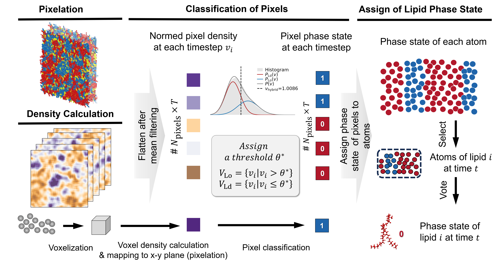

# Recognition of coexisting phases in model membranes via an unsupervised method

This repository contains the scripts, data, and workflows used in our study  
**"Recognition of coexisting phases in model membranes via an unsupervised method."**

---

## 🧠 Overview

<p align="center">
  
</p>

*Figure: Overview of the unsupervised method for lipid phase recognition.*

In this work, we developed an **unsupervised method** to recognize coexisting phases not only in lipid mixtures but also in **protein-containing bilayers**.  

Our method:
- Maps bilayer properties (atomic density) to **pixels** on the membrane plane.  
- Uses a **uniform strategy** to define the threshold θ\* for discriminating between the two phases (rather than assuming a fixed global threshold); 
- Maps pixel phase states back to **lipids**.  

This strategy is **independent of bilayer composition and temperature**, avoiding system-specific artifacts.  
The method shows improved **accuracy and robustness** compared to other methods such as **HMM**, and can characterize **dynamic phase transformations** even in the presence of **membrane proteins**.

---

## 📁 Repository Structure

```text
Phase_identification/
│
├── scripts_for_phase_identification/
│   ├── phase_identification_pure_lipids.ipynb    # Phase recognition pipeline for pure lipid bilayers
│   ├── phase_identification_with_protein.ipynb   # Phase recognition pipeline for protein-containing bilayers
│   ├── run_pure_lipids.sh                        # Shell script for full-trajectory phase identification (pure lipids)
│   └── phase_identification_pure_lipids.py       # Implementation of phase recognition for pure lipid system
│
├── analysis/
│   └── summary.ipynb                             # Data statistics & postprocessing
│   └── Voronoi_area_*.py                         # Area-per-lipid (APL) calculations
│
├── leaflet/
│   └── *_leaflet.xvg                             # Leaflet assignment for all lipids
│   └── README.md
│
├── md_data/
│   └── ...                                       # The parameter file (.tpr), as well as the initial and final configurations for each system
│   └── README.md
│
├── plot/
│   └── input/                                    # All input data used for plotting
│   └── output/                                   # All output figures
│   └── scripts/                                  # Plotting scripts
│   └── README.md
│
├── requirements.txt                              # Python dependencies
└── README.md
```

---

## ⚙️ Environment Setup

Clone the repository and install dependencies:

```bash
git clone https://github.com/YommyM/Phase_identification.git
cd Phase_identification
pip install -r requirements.txt
