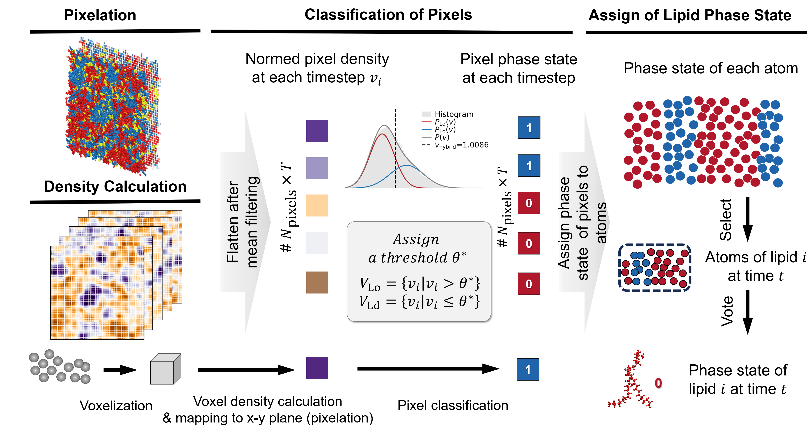

# Recognition of coexisting phases in model membranes via an unsupervised method

This repository contains the scripts, data, and workflows used in our study  
**"Recognition of coexisting phases in model membranes via an unsupervised method."**

---

## 🧠 Overview

<p align="center">
  
</p>

*Figure: Overview of the unsupervised method for lipid phase recognition.*

In this work, we developed an **unsupervised method** to recognize coexisting phases not only in lipid mixtures but also in **protein-containing bilayers**.  

We compute lipid number densities in **3D voxels** and then **project along the membrane normal (z)** to obtain a **2D pixel density map** on the membrane plane. Pixel-level phase labels are assigned using a GMM-based threshold θ\* and then **back-mapped** to generate per-lipid phase labels.

- **Voxel density (3D):** number density computed on a 3D grid.
- **Projection:** integrate voxel densities along **z** to obtain a 2D density field.
- **Pixel classification (2D):** classify each pixel using θ\*.
- **Back-mapping:** assign each lipid a phase label from the pixel it belongs to.

**Phase label definition**
- `0` = **Ld** (liquid-disordered)
- `1` = **Lo** (liquid-ordered)

**Advantages of our method**
- The mapping between lipid-level properties and pixel-level properties effectively averages local fluctuations and suppresses sporadic lipids whose instantaneous phase states differ from their surroundings.
- Uses a **uniform, system-adaptive strategy** to determine the discrimination threshold θ\* between the two phases (instead of assuming a fixed global threshold), thereby minimizing threshold-induced artifacts.
- Maps pixel-level phase states back to **individual lipids**, enabling **single-lipid–resolution** phase assignment **continuously along the full trajectory** (i.e., frame-by-frame labels for every lipid across time).
- Does not require any labeled dataset, providing high flexibility and portability across different membrane compositions and simulation setups.
- Shows improved **accuracy and robustness** compared to alternative approaches such as **hidden Markov model (HMM)-based** methods.
- Can characterize **dynamic phase transformations** and remains applicable even in the presence of **membrane proteins**.


---

## 📁 Repository Structure

```text
Phase_identification/
│
├── scripts_for_phase_identification/
│   ├── phase_identification_pure_lipids.ipynb    # Phase recognition pipeline for pure lipid bilayers
│   ├── phase_identification_with_protein.ipynb   # Phase recognition pipeline for protein-containing bilayers
│   ├── run_pure_lipids.sh                        # Shell script for full-trajectory phase identification (pure lipids)
│   └── phase_identification_pure_lipids.py       # Implementation of phase recognition for pure lipid system
│
├── analysis/
│   └── summary.ipynb                             # Data statistics & postprocessing
│   └── leaflet_assignment.ipynb                  # Leaflet assignment file generation
│   └── Voronoi_area_*.py                         # Area-per-lipid (APL) calculations
│
├── leaflet/
│   └── *_leaflet.xvg                             # Leaflet assignment for all lipids
│   └── README.md
│
├── md_data/
│   └── ...                                       # The parameter file (.tpr), as well as the initial and final configurations for each system
│   └── README.md
│
├── plot/
│   └── input/                                    # All input data used for plotting
│   └── output/                                   # All output figures
│   └── scripts/                                  # Plotting scripts
│   └── README.md
│
├── requirements.txt                              # Python dependencies
└── README.md
```

---
## 🚀 Usage: Phase Identification of Lipid Membranes

This repository provides a workflow to identify lipid phases (Ld / Lo) from molecular dynamics trajectories by combining pixel-based spatial discretization, and Gaussian Mixture Model (GMM) classification.

Phase labels are assigned at the **per-lipid** level by first classifying membrane pixels and then back-mapping pixel labels to individual lipids.

### Key parameters (user-configurable)

The following parameters control the time window and spatial resolution. They are **user-configurable** in the notebook/scripts.

#### Time window
- `start`: starting frame index (inclusive)
- `end`: ending frame index (exclusive)
- `n_gap`: temporal averaging stride (default: `5`)
  - Example: if your trajectory is saved every 1 ns, `n_gap = 5` corresponds to averaging every 5 ns.

> **Default analysis** uses the **last 1 μs** of the trajectory and averages densities every **5 ns**, but this can be changed by adjusting `start`, `end`, and `n_gap`.

#### Spatial binning
- `bin_width`: pixels bin width (default: `3`)
  - Unit: **Å** 

> Tip: smaller `bin_width` gives higher spatial resolution but noisier densities.

---

### 1. Leaflet assignment

Prepare a **leaflet assignment file** for the system of interest.

**Definition**
- `0` → upper leaflet  
- `1` → lower leaflet  

**File format**
- Each row corresponds to one trajectory frame.
- Columns:`[n_fr, lipid1, lipid2, …, lipid1152]`

> **Important:**  
> The lipid ordering in this file must be consistent with the ordering used in the trajectory and topology files.

We provide `analysis/leaflet_assignment.ipynb` as an example workflow for one system. Please adapt the notebook to your own system (e.g., update lipid selections, residue IDs, and ensure consistent lipid ordering).

---

### 2. Phase identification on the last 1 μs

The recommended workflow is to first perform phase identification on the **last 1 μs** of the trajectory.  
This step determines the optimal classification threshold θ\* and stores normalization parameters for later use.

---

#### 2.1 Pure lipid systems (no protein)

Run the notebook: `phase_identification_pure_lipids.ipynb`

**Workflow**

1. **Pixelization**  
   The membrane plane is discretized into a 3D voxels.

2. **Density calculation**  
   For the last **1 μs**, atom number densities are calculated for each voxel and averaged every **5 ns**.

3. **Normalization and GMM fitting**  
   Pixels were then defined as the two-dimensional projections of these voxels onto the membrane plane. Normed pixel densities are normalized and fitted using a Gaussian Mixture Model (GMM). The discrimination threshold θ\* was then derived from the fitted model to separate the two phases.

4. **Pixel classification**  
   Each pixel is classified using θ\*.

5. **Back-mapping to lipids**  
   Pixel phase labels are mapped back to individual lipids.

**Phase label definition**
- `0` → Ld (liquid-disordered)
- `1` → Lo (liquid-ordered)

**Outputs**
- A phase label matrix of shape `n_T × n_lipids`.
- A `parameters.json` file storing:
  - mean pixel densities within `n_T`
  - the selected threshold θ\*

These parameters are required for optional full-trajectory phase identification.

---

#### 2.2 Systems containing proteins

The overall workflow is identical to that for pure lipid systems, except that **pixel density calculation differs** due to the presence of proteins, as described in the manuscript.

**Notes**
- Users must modify the scripts to correctly handle **protein residue IDs (resid)** and **lipid residue IDs (resid)** for their specific system.

**Outputs**
- Phase label matrix of shape `n_T × n_lipids` for the last 1 μs.
- A `parameters.json` file containing density normalization parameters and θ\*.

---

### 3. (Optional) Full-trajectory phase identification (pure lipid systems)

If phase labels for the entire trajectory are required, run the full-trajectory pipeline for pure lipid systems using:

- Shell script: `run_pure_lipids.sh`
- Python script: `phase_identification_pure_lipids.py`

**Workflow**

1. Pixelize the membrane and compute pixel densities.
2. Normalize pixel densities using the mean densities stored in `parameters.json`.
3. Classify pixels directly using the stored threshold θ\*.
4. Back-map pixel labels to individual lipids.

**Output**
- Full-trajectory phase label matrix of shape `n_T × n_lipids`
  (`0` = Ld, `1` = Lo) in `xxx.xvg`.

---

### Summary of inputs and outputs

**Inputs**
- MD trajectory and topology files
- Leaflet assignment file (`0` = upper leaflet, `1` = lower leaflet)

**Outputs**
- `xxx.xvg` Lipid phase labels (`n_T × n_lipids`, `0` = Ld, `1` = Lo)
- `parameters.json` (density statistics and θ\*)

---

## ⚙️ Environment Setup

Clone the repository and install dependencies:

```bash
git clone https://github.com/YommyM/Phase_identification.git
cd Phase_identification
pip install -r requirements.txt
```

---

## 📚 Citation

If you find this work useful, please consider citing our paper:

**Dai, Y.; Zhao, J.; Wang, B.; Liang, Q.; Gu, R.-X.**  
*Recognition of Coexisting Phases in Model Membranes via an Unsupervised Method.*  
**Journal of Chemical Information and Modeling**, 2026.

```bibtex
@article{dai2026recognition,
  title={Recognition of Coexisting Phases in Model Membranes via an Unsupervised Method},
  author={Dai, Yuzhuo and Zhao, Jianwei and Wang, Beibei and Liang, Qing and Gu, Ruo-Xu},
  journal={Journal of Chemical Information and Modeling},
  year={2026},
  publisher={ACS Publications}
}
